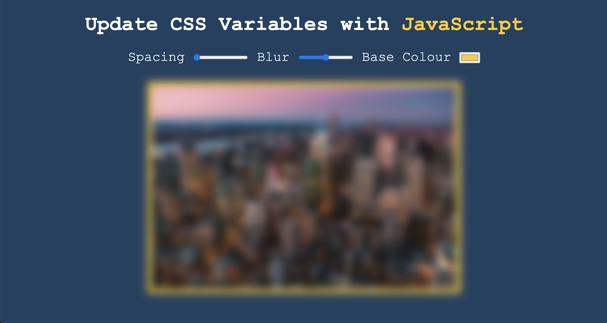
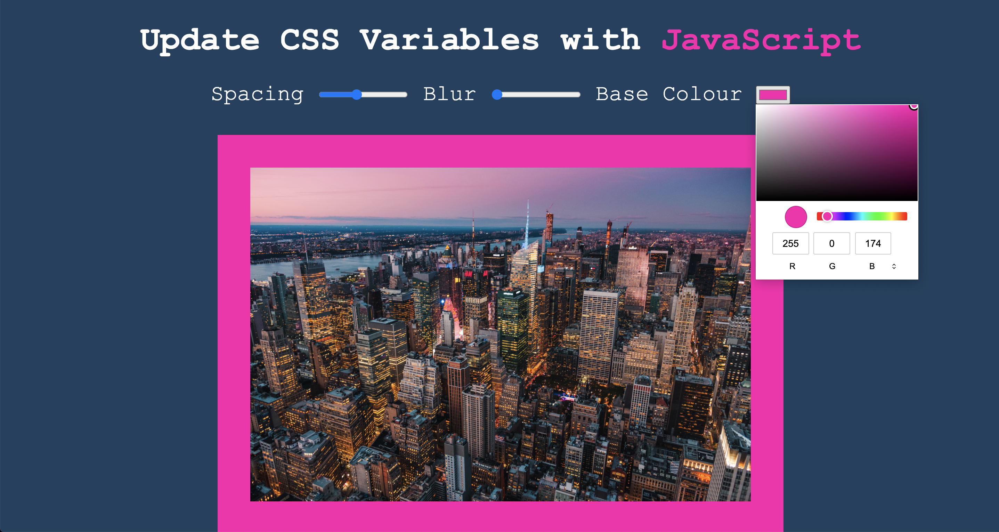

# Practicing HTML variables with JavaScript

### Default Homepage (before using the controls)

---
### Page after using some of the controls (changed blur level, base colour and image background size)
